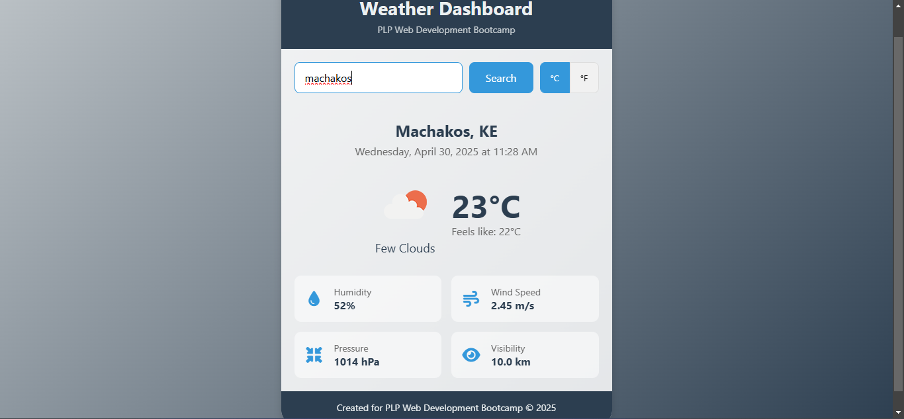

# 🌤️ PLP Weather App

This is a simple and responsive weather application built as part of the **Power Learn Project (PLP)**.  
The app allows users to search for any city and view real-time weather data such as temperature, humidity, wind speed, and general conditions.

🚀 **Live Demo**: [https://iamjefwa.github.io/plp-weather-app/](https://iamjefwa.github.io/plp-weather-app/)

---

## 🔧 Features

- 🌍 Search for any city
- 📡 Real-time weather data from OpenWeatherMap API
- 🌡️ Display temperature, humidity, wind speed, and weather condition
- 🖥️ Clean and responsive UI using HTML, CSS, and JavaScript
- ⚠️ Error handling for invalid city inputs

---

## 🛠️ Technologies Used

- HTML5
- CSS3
- JavaScript (Vanilla JS)
- OpenWeatherMap API

---

## 🧪 How to Run Locally

1. Clone this repository:
   ```bash
   git clone https://github.com/IamJefwa/plp-weather-app.git
   cd plp-weather-app
2. Open index.html in your browser to run it locally.

3. (Optional) If modifying the code, replace the API key inside script.js with your own from https://openweathermap.org/.


## 📸 Screenshots



## 🧑‍💻 Author
Jefwa Kalama
GitHub | LinkedIn

## 📜 License
This project is open-source and free to use for learning and demonstration purposes.
